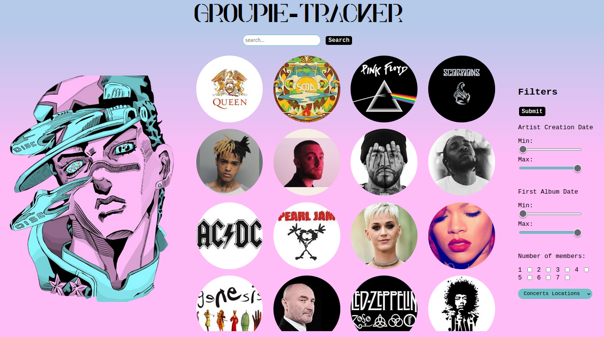
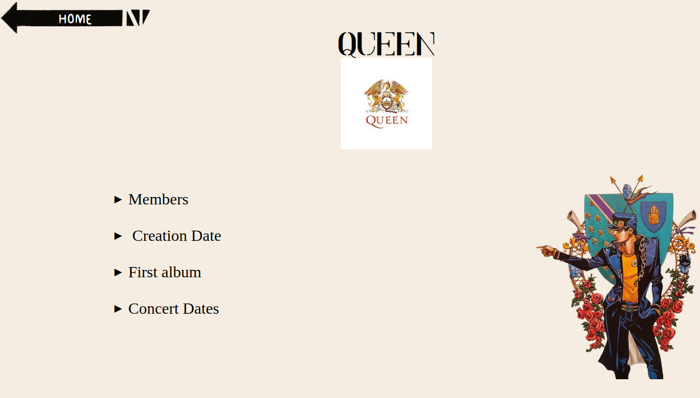
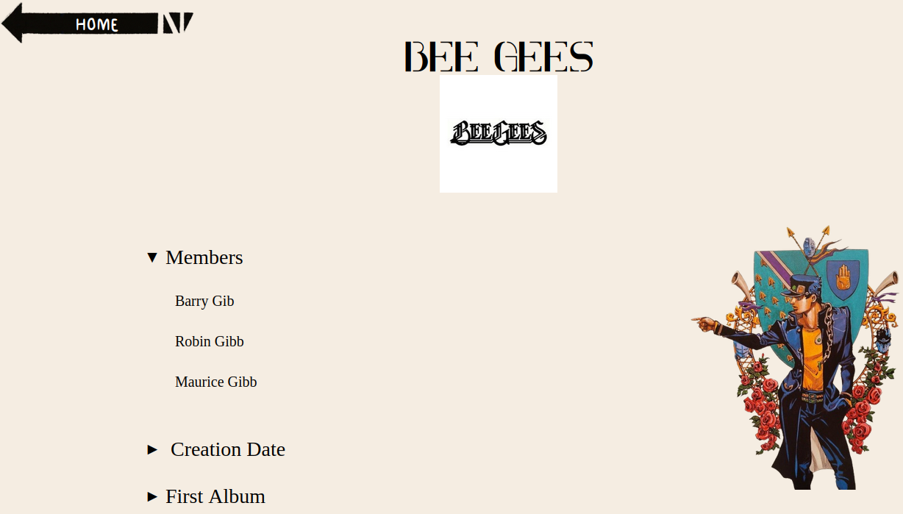
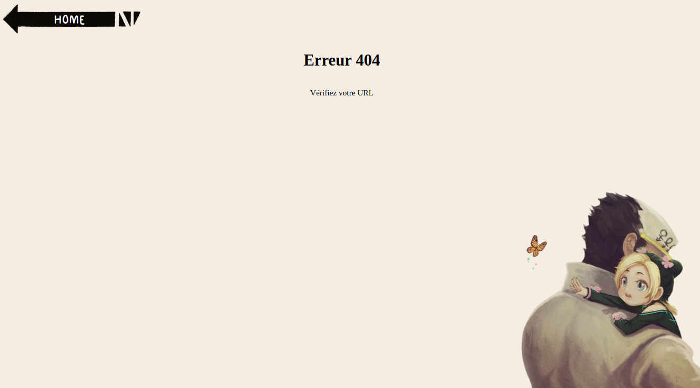

# Groupie-Tracker

Groupie-Tracker is a project written in Golang aimed at receiving a given [API](https://groupietrackers.herokuapp.com/api) and manipulating the contained data to create a website displaying the information. The provided APIs contain music group names, along with their albums, artists, creation dates, first album dates, and concert dates.
This project was carried out as part of the training : [Zone01](https://zone01rouennormandie.org/).
<p align="center">
  
</p>

## Features

- Display a list of music groups on the homepage.
- Click on a group's image to navigate to its dedicated : 
   - Members.
   - Creation Date.
   - First Album.
   - Concert Dates.
   <p align="center">
   
   </p>
- Click on one (or all) of them to view displaying detailed information :
   <p align="center">
   
   </p>
- Search functionality allows users to search for groups, artists, album names, and concerts.
   - Please note, you must return to the home page to restart a search.
- Filters enable users to refine the list of displayed groups on the homepage.
- Handling 3 errors (400, 404 and 500)
   <p align="center">
   
   </p>
- Styled with CSS inspired by ***JoJo's Bizarre Adventure***.

## Installation

To run Groupie-Tracker locally, follow these steps:

1. Clone this repository to your local machine.
   ```
   git clone https://github.com/yourusername/groupie-tracker.git
   ```
2. Navigate to the project directory.
   ```
   cd groupie-tracker
   ```
3. Build the project.
   ```
   go build cmd/main.go
   ```
4. Run the executable.
   ```
   ./groupie-tracker
   ```
5. if you don't want build, you could run the project.
   ```
   go run cmd/main.go
   ```
6. Access the application in your web browser at `http://localhost:8080` or click in your terminal on the link.

## Usage

Upon running Groupie-Tracker, you can access the homepage where a list of music groups is displayed. You can click on any group's image to view detailed information about that group on a separate page. The search bar allows you to search for specific groups, artists, albums, or concerts (you must return to the home page to restart a search). Additionally, filters are available to narrow down the displayed groups based on certain criteria.

## Geolocalization

Groupie tracker geolocalization was done locally. This project is not in this repository as it was linked to a Google account. If you want to know more about this project, please go to the "instructions_audits" folder and click on the corresponding links.

## Co-developers

- [Delemos Dit Pereira Brice](https://github.com/BriceDelemosDitPereira)
- Fouquemberg Axelle
- [Lovergne Raphael](https://github.com/Ne0Jiku)